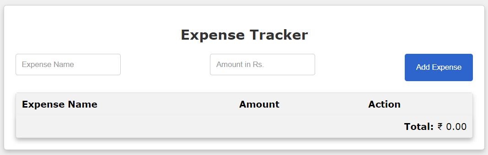

# Expense Tracker

Expense Tracker is a simple web application that allows you to track your expenses. You can add and remove expenses and keep a running total of your spending.

[Click Here](https://geeekdude.github.io/Expense-Tracker) for the <strong>Live Demo</strong>.

## Features

- Add expenses with a name and amount.
- Delete expenses.
- See the total amount spent.
- User-friendly interface.
- Data is stored locally in your browser.

## Technologies Used

- HTML
- CSS
- JavaScript

## Installation

1. Clone the repository or download the ZIP file.
2. Open `index.html` in your web browser.

## Usage

1. Enter the name and amount of the expense in the input fields.
2. Click "Add Expense" to add the expense to the list.
3. To delete an expense, click "Delete" next to the expense.
4. The total amount spent is displayed at the bottom.

## Contributing

Contributions are welcome! If you have any ideas for improvements, open an issue or create a pull request.

## License

This project is open-source and available under the MIT License.

## Author

Prateek Kumar

## Contact

- Email: prateeeek02@gmail.com
- GitHub: [GitHub Profile](https://github.com/geeekdude)
